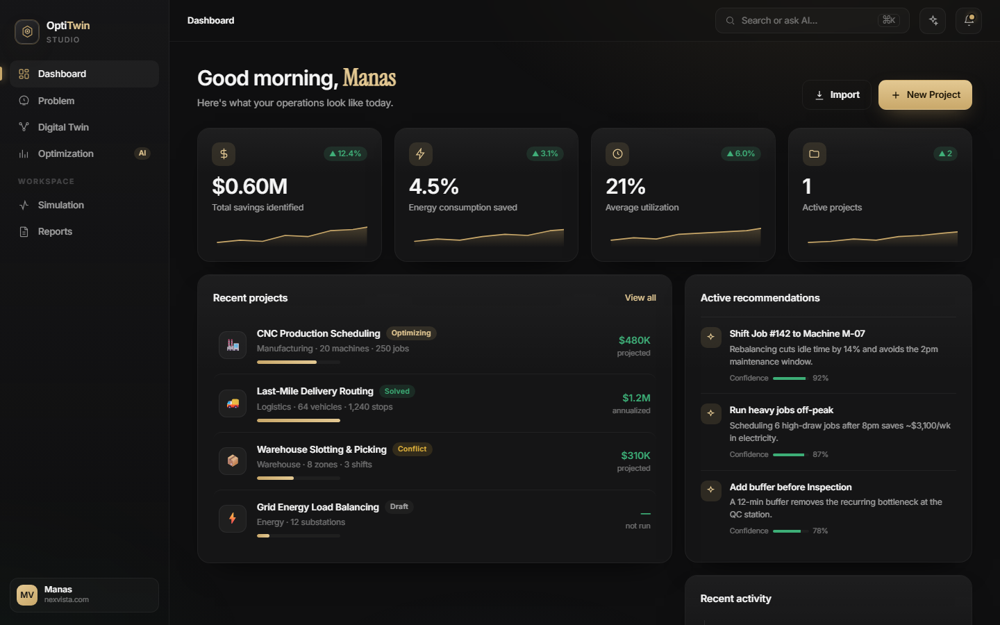
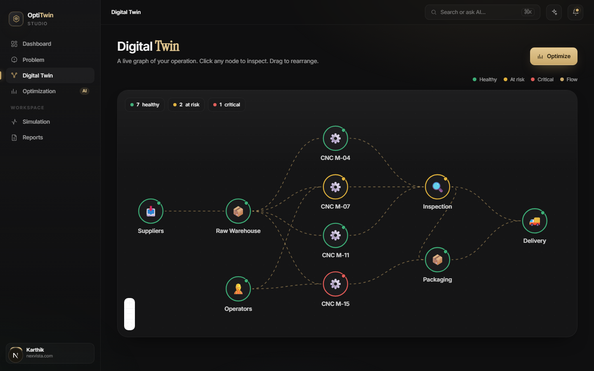
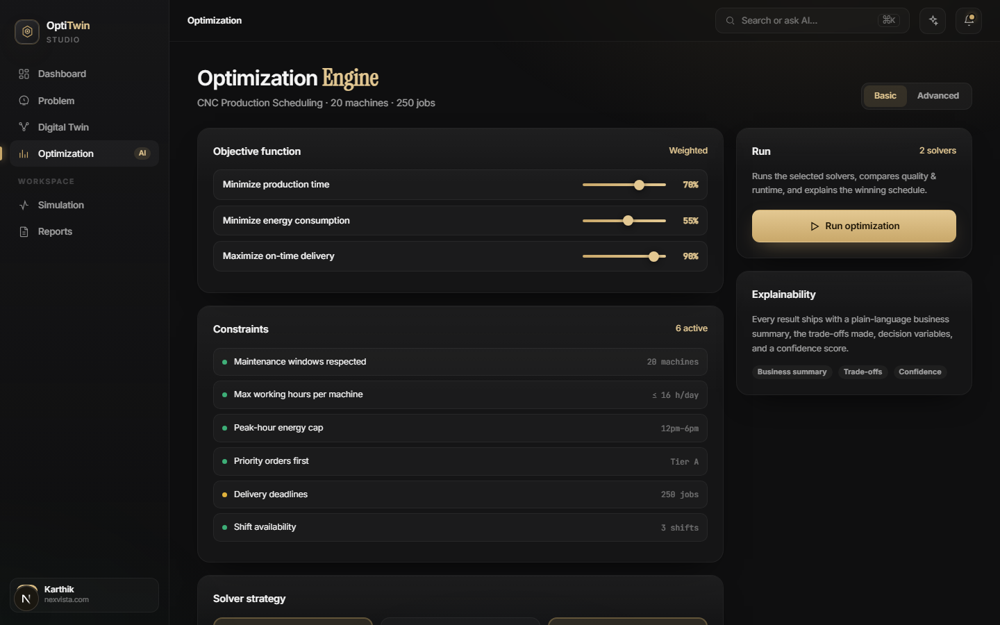
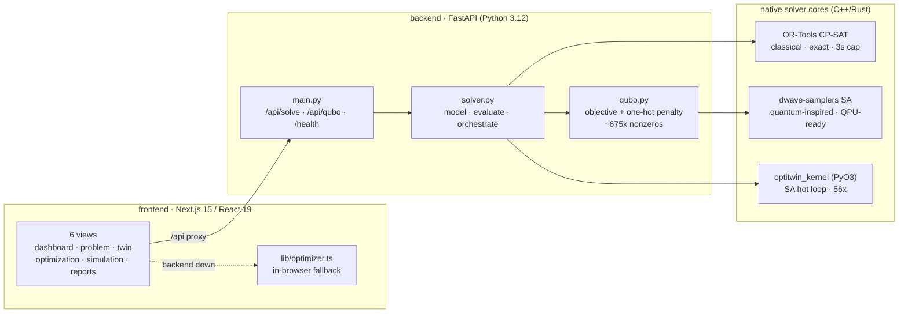

# OptiTwin Studio

[](https://github.com/manas-vamsi/OptiTwin-Studio/actions/workflows/ci.yml)
  

Enterprise decision-intelligence platform — **Design • Simulate • Optimize • Explain**.
Describe an operations problem in plain language; the platform builds a digital twin,
solves it with classical / quantum-inspired / hybrid optimizers, simulates scenarios,
and explains every decision.

> Quantum is one solver, not the point. This is an optimization platform.



| Digital Twin | Optimization Engine |
|---|---|
|  |  |

## Architecture



Every solve request runs three genuinely different methods and reports each
one's true engine and wall-clock time; any missing library degrades to the
pure-Python path, and a dead backend degrades to the in-browser optimizer.

## Structure

```
frontend/    Next.js 15 · React 19 · TypeScript · Tailwind        (the UI)
  app/         App Router pages (dashboard, problem, twin, optimization, simulation, reports)
  components/  Sidebar, Topbar, KPI/spark widgets
  lib/         optimizer.ts (client fallback), api.ts, types.ts
backend/     FastAPI · Python                                      (the solver service)
  app/         main.py (API), solver.py (engine), qubo.py (QUBO), db.py (run history), models.py
  kernel/      Rust SA kernel (PyO3) — 56x faster hot loop, optional
  tests/       runnable solver tests + kernel benchmark
prototype/   original single-file design reference (index.html)
```

## Run

Presenting this at a demo or exhibition? The 3-minute walkthrough and Q&A
answers live in [DEMO.md](DEMO.md).

**One command (Docker)**
```bash
docker compose up            # frontend :3000, backend :8000
```

**Or by hand — Backend**
```bash
cd backend
python -m venv .venv && .venv/Scripts/activate   # Windows;  source .venv/bin/activate on *nix
pip install -r requirements.txt
uvicorn app.main:app --reload            # http://localhost:8000
python tests/test_solver.py              # run tests
```

**Frontend**
```bash
cd frontend
npm install
npm run dev                              # http://localhost:3000  (proxies /api -> :8000)
```

The frontend calls the backend `/api/solve`; if the backend is down it falls back to the
identical client-side optimizer, so the UI always works.

## The optimizer

Real operations-research — three genuinely different solvers on one model:

- **Model** — 250 jobs on 20 machines, per-machine speed + power, 12–18h peak tariff (1.6×), deadlines, A/B/C priority tiers.
- **Baseline** — naive round-robin.
- **Classical** — OR-Tools **CP-SAT** (Google's C++ MIP engine): exact assignment
  minimizing makespan + energy under a 3 s time cap, then EDD sequencing + SA polish.
- **Quantum-inspired** — full **QUBO** (`qubo.py`): objective terms (time + energy +
  load-balance quadratic) plus one-hot penalty, ~675 k nonzeros, annealed by
  `dwave-samplers` (C++ core). The same matrix + pipeline a D-Wave QPU consumes.
- **Hybrid** — QUBO annealing for the assignment + simulated-annealing local search
  for sequencing (assignment is QUBO-expressible; sequencing isn't — that split
  *is* the hybrid).

Every path falls back to the pure-Python greedy+SA solver if its library is
missing or fails, and each result reports its true `backend`
(`cpsat` / `neal` / `neal+sa` / `python`) and wall-clock solve time.
Python 3.11/3.12 needed for the ortools + dwave-samplers wheels; any Python runs the fallback.

## Rust kernel (optional, 56x)

The SA hot loop is also implemented in Rust (`backend/kernel/`, PyO3) — same
model, same LCG PRNG, so results are **bit-identical** to the Python loop at
equal seed and iterations. When installed, the engine spends the speedup on
search depth (50x more iterations in less wall time), which measurably
improves the hybrid solver. Python stays the orchestration layer — the same
architecture as Polars / Pydantic v2 / ruff.

```bash
cd backend/kernel
maturin build --release            # needs rustup; wheel lands in target/wheels/
pip install target/wheels/*.whl
python ../tests/bench_kernel.py    # verifies identical results + prints speedup
```

## Roadmap (view-by-view PRs)

- [x] Dashboard, Optimization (backend-integrated)
- [x] Problem (AI extraction UI — editable resource/constraint/objective chips)
- [x] Digital Twin (React Flow graph + node inspector drawer)
- [x] Simulation (scenario library — 6 what-ifs, engine-driven deltas)
- [x] Reports (executive/optimization/technical + CSV/PDF)
